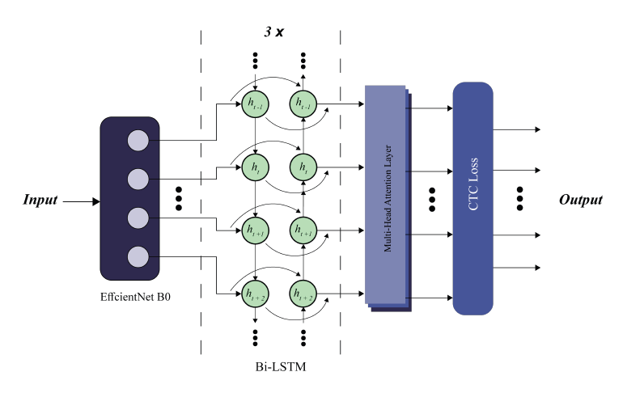
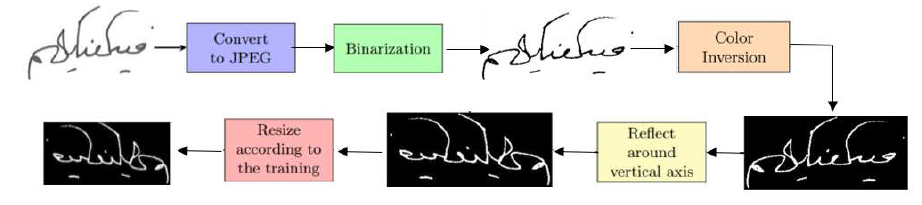

# 📘 **Arabic Handwritten Text Recognition using Advanced CNN-RNN Architecture** 

## 🧭 Overview

This repository contains the official implementation of the model introduced in the paper:

[**_Arabic Handwritten Text Recognition using Advanced CNN-RNN Architecture_**](https://www.researchgate.net/publication/383948237_Arabic_Handwritten_Text_Recognition_using_Advanced_CNN-RNN_Architecture)  (2024)  

The project implements a full training and evaluation pipeline for Arabic handwritten text recognition using a hybrid **EfficientNetB3 + BiLSTM + Multi-Head Self-Attention + CTC** architecture.


## 🧠 Proposed Architecture
<u>The proposed architecture, shown in `fig.1`, consists of:</u>

- **EfficientNetB3** as a convolutional feature extractor.  
- Feature map reshaping into a temporal sequence.  
- **3× Bidirectional LSTM** layers.  
- **Multi-Head Attention** to enhance sequence modelling.  
- **CTC Layer** for alignment-free transcription.



**Figure 1:** The proposed CNN-RNN architecture

## 📂 Dataset Structure
```
Datasets/
   └── khatt/
        ├── train/
        │    ├── images/
        │    └── labels/
        ├── validate/
        │    ├── images/
        │    └── labels/
        └── test/
             ├── images/
             └── labels/
```
- Images must be `.jpeg`  
- Labels must be `.txt` containing the ground truth Arabic text  
- Filenames must match exactly between `images` and `labels`

## 🧼 Preprocessing

### Every image undergoes the following, which is summarized in `fig.2`:

- Distortion-free resize  
- Centered padding  
- Transpose + vertical flip (dataset-specific)  



**Figure 2:** Preprocessing Steps

### In addition, optional augmentation includes:
- Shearing (X & Y)
- Brightness/contrast jitter 

Labels are encoded using **StringLookup** with **fixed-length padding** using a special `padding_token`.


## 🌳 Project Organization Tree

```
.
├── README.md
├── evaluate.py
├── model.py
├── preprocessing.py
├── train.py
└── utils.py
```

## 🏋️ Training

To begin training:

```bash
python train.py
```

### Training includes:

- Automatic vocabulary construction
- Saving `num_to_char.json` for decoding
- EfficientNet finetuning
- Cosine learning rate scheduling
- Early stopping
- Best-model checkpointing (`best_model_khatt.h5`)
- Edit-distance callback for validation tracking

## 🧪 Evaluation

```bash
python evaluate.py
```
### The script computes:
- Prediction per sample
- Character-level accuracy
- Global accuracy
- Inspectable decoded outputs

## 📝 Citation

If you find this repository useful, include us in your citation:

```bibtex
@INPROCEEDINGS{Mohamed24,
  title={Arabic Handwritten Text Recognition using Advanced CNN-RNN Architecture},
  author={Elsayed, Mohamed and Alnaggar, Ahmed and Abdeen, Mohamed and Wahdan, Abdelrhman and Gomaa, Walid},
  editor={Sfikas, G. and Retsinas, G.},
  booktitle={16th International Workshop on Document Analysis Systems 2024},
  doi={10.5281/zenodo.14311999},
  pages={19--30},
  address={Athens, Greece},
  year={2024},
  month={September}
}
```


